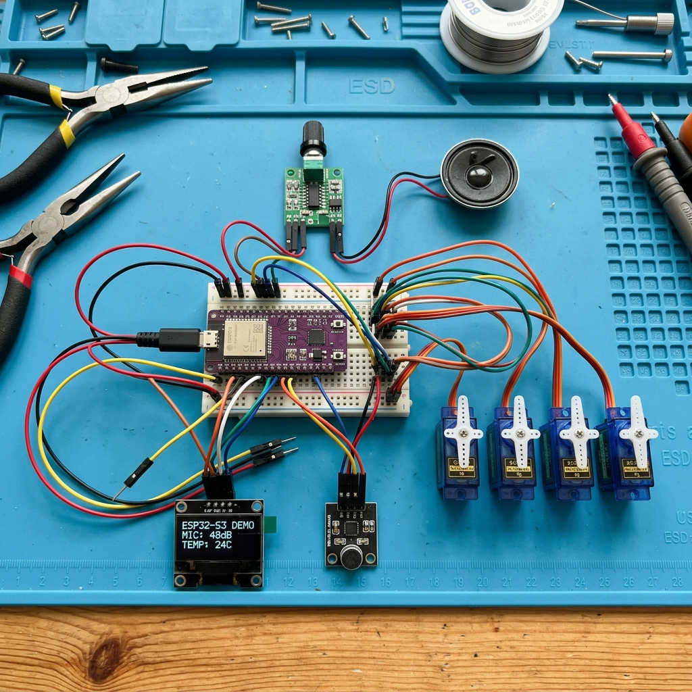

# 桌面小狗 (Xiaozhi Dog) 硬件连接实体图

基于当前代码（`bread-compact-wifi` 开发板配置），我们为您生成了最权威、最详细的硬件连接图表及参考图。这可以帮助您在面包板或 PCB 上进行物理接线。

## 📸 1. 硬件连接图 (2D 拓扑)

下面是我们为您生成的专属二维连线拓扑图，详细标注了每一个模块的管脚接线对应关系，**请严格参考此图进行连线**。

> [!TIP]
> 上图是我们通过代码生成的精准接线拓扑，能清晰看到每根杜邦线的连接起点和终点。如果需要查看 AI 渲染的 3D 实物参考图：
> 

---

## 🔌 2. 管脚连接逻辑图 (Mermaid)

以下拓扑图详细展示了 ESP32-S3 与外设的真实接线关系，请按照此图进行杜邦线连接。所有的模块**必须共地**！

```mermaid
flowchart TD
    %% 定义样式
    classDef esp32 fill:#1a1a1a,stroke:#4CAF50,stroke-width:2px,color:#fff,rx:10px
    classDef mic fill:#003366,stroke:#00bfff,stroke-width:1px,color:#fff
    classDef spk fill:#660000,stroke:#ff6666,stroke-width:1px,color:#fff
    classDef oled fill:#006633,stroke:#33cc33,stroke-width:1px,color:#fff
    classDef servo fill:#663300,stroke:#ff9933,stroke-width:1px,color:#fff
    classDef power fill:#ffcc00,stroke:#cc9900,stroke-width:2px,color:#000
    classDef button fill:#333333,stroke:#999999,stroke-width:1px,color:#fff

    %% 核心控制器
    ESP32[ESP32-S3 开发板]:::esp32
    
    %% 电源系统
    Power5V[外部 5V / 2A+ 电源]:::power
    
    %% 麦克风 (INMP441)
    subgraph MIC[麦克风 INMP441]
        MIC_VDD[VDD]:::mic
        MIC_GND[GND]:::mic
        MIC_L_R[L/R]:::mic
        MIC_WS[WS]:::mic
        MIC_SCK[SCK]:::mic
        MIC_SD[SD]:::mic
    end
    
    %% 扬声器 (MAX98357A)
    subgraph SPK[喇叭功放 MAX98357A]
        SPK_VIN[VIN]:::spk
        SPK_GND[GND]:::spk
        SPK_DIN[DIN]:::spk
        SPK_BCLK[BCLK]:::spk
        SPK_LRC[LRC]:::spk
    end
    
    %% OLED 屏幕
    subgraph SCREEN[OLED 屏幕 128x64]
        OLED_VCC[VCC]:::oled
        OLED_GND[GND]:::oled
        OLED_SDA[SDA]:::oled
        OLED_SCL[SCL]:::oled
    end
    
    %% 舵机系统
    subgraph SERVOS[小狗四肢舵机]
        SV_LF[左前腿信号线]:::servo
        SV_RF[右前腿信号线]:::servo
        SV_LB[左后腿信号线]:::servo
        SV_RB[右后腿信号线]:::servo
        SV_VCC[4个舵机红线 VCC]:::servo
        SV_GND[4个舵机棕线 GND]:::servo
    end
    
    %% 实体按键
    subgraph BTN[实体按键]
        BTN_TOUCH[触摸/打断键]:::button
        BTN_VOL_UP[音量 +]:::button
        BTN_VOL_DN[音量 -]:::button
    end

    %% --- 连接关系 ---
    
    %% 电源与共地
    Power5V -- "5V 供电" --> SV_VCC
    Power5V -- "共地" --- ESP32
    SV_GND -- "接电源 GND" --- Power5V
    
    ESP32 -- "3.3V" --> MIC_VDD
    ESP32 -- "3.3V" --> SPK_VIN
    ESP32 -- "3.3V" --> OLED_VCC
    
    ESP32 -- "GND" --- MIC_GND
    MIC_GND --- MIC_L_R
    ESP32 -- "GND" --- SPK_GND
    ESP32 -- "GND" --- OLED_GND
    
    %% 麦克风连接
    ESP32 -- "GPIO 4" --> MIC_WS
    ESP32 -- "GPIO 5" --> MIC_SCK
    MIC_SD -- "GPIO 6" --> ESP32
    
    %% 扬声器连接
    ESP32 -- "GPIO 7" --> SPK_DIN
    ESP32 -- "GPIO 15" --> SPK_BCLK
    ESP32 -- "GPIO 16" --> SPK_LRC
    
    %% OLED 连接
    ESP32 -- "GPIO 41" --> OLED_SDA
    ESP32 -- "GPIO 42" --> OLED_SCL
    
    %% 舵机连接
    ESP32 -- "GPIO 17" --> SV_LF
    ESP32 -- "GPIO 13" --> SV_RF
    ESP32 -- "GPIO 18" --> SV_LB
    ESP32 -- "GPIO 14" --> SV_RB
    
    %% 按键连接
    BTN_TOUCH -- "GPIO 47 (另一端接地)" --> ESP32
    BTN_VOL_UP -- "GPIO 40 (另一端接地)" --> ESP32
    BTN_VOL_DN -- "GPIO 39 (另一端接地)" --> ESP32
```

> [!WARNING]  
> **高危警告（舵机供电）：** 舵机在运动时会瞬间抽取巨大的电流！**绝对不要**用 ESP32 开发板上的 3.3V 甚至 5V 引脚直接给 4 个舵机同时供电！否则极易导致 ESP32 芯片电压不稳而无限重启。请务必使用独立的 5V 电源给舵机供电，并将该电源的 GND 与 ESP32 的 GND 相连。

---

## 📌 3. 详细接线对照表

如果您需要按照表格一一核对检查连线，请参考下表：

| 硬件模块 | 模块引脚 | ESP32-S3 开发板引脚 | 说明 |
| :--- | :--- | :--- | :--- |
| **麦克风 (INMP441)** | VDD | 3.3V | 建议接开发板 3.3V |
| | GND | GND | 与开发板共地 |
| | L/R | GND | 接地为左声道 |
| | WS | **GPIO 4** | 帧时钟 |
| | SCK | **GPIO 5** | 串行时钟 |
| | SD/DIN | **GPIO 6** | 音频数据输出 |
| **喇叭功放 (MAX98357A)** | VIN/VCC | 3.3V | |
| | GND | GND | 与开发板共地 |
| | DIN/DOUT | **GPIO 7** | 音频数据输入 |
| | BCLK | **GPIO 15** | 串行时钟 |
| | LRC/LRCK | **GPIO 16** | 帧时钟 |
| **OLED 屏幕 (I2C)** | VCC | 3.3V | 屏幕供电 |
| | GND | GND | 与开发板共地 |
| | SDA | **GPIO 41** | 数据线 |
| | SCL | **GPIO 42** | 时钟线 |
| **舵机 (四肢)** | 左前腿信号(黄/橙) | **GPIO 17** | 控制左前腿 |
| | 右前腿信号(黄/橙) | **GPIO 13** | 控制右前腿 |
| | 左后腿信号(黄/橙) | **GPIO 18** | 控制左后腿 |
| | 右后腿信号(黄/橙) | **GPIO 14** | 控制右后腿 |
| | 电源 VCC (红) | 外部 5V 独立供电 | **千万不要接在开发板上** |
| | 接地 GND (棕/黑) | 外部电源 GND | **必须与开发板 GND 相连** |
| **按键模块** | 触摸打断键 | **GPIO 47** | 按下接地 (GND) |
| | 音量+ | **GPIO 40** | 按下接地 (GND) |
| | 音量- | **GPIO 39** | 按下接地 (GND) |
